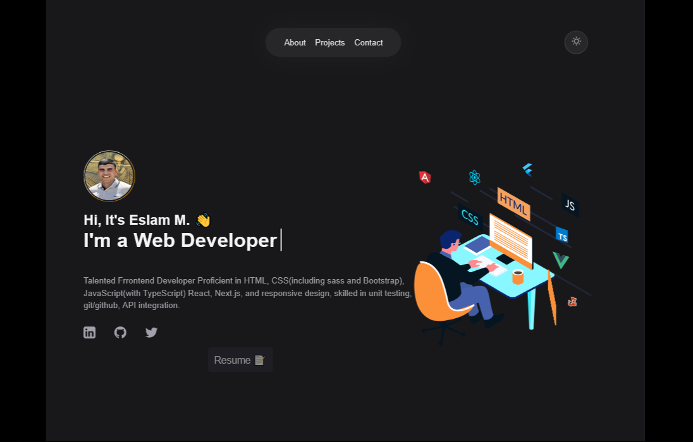

<h1 align="center">[Welcome to developer-portfolio 👋](https://eslam-m.vercel.app)</h1>

## FrontEnd Developer Portfolio Template built with React + Vite,that helps you showcase your work and skills as a software developer.

[

  <kbd>
    </img>
  </kbd>

](https://eslam-m.vercel.app)

## Sections

✔️ Hero\
✔️ About Me\
✔️ Projects\
✔️ Contact

## Technologies Used

- [react-vite](https://vitejs.dev/guide/)
- [react-lottie](https://www.npmjs.com/package/react-lottie)

## Illustrations

- [Lottie File Source](https://lottiefiles.com)

## Icons

Iconmoon Icons are used in the skill section. You can find all the icons here: [Iconmoon](https://icomoon.io).

## For the Future

- Add More Sections